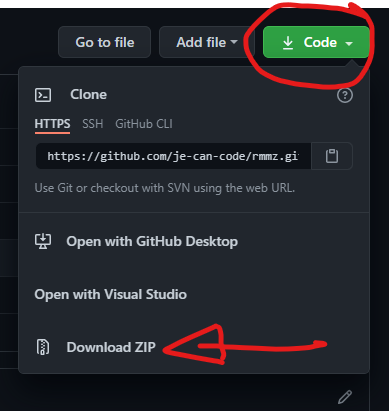

# J's Land of Plugins

This project is a test bed for all plugins I am actively developing/maintaining.

## Using the plugins
There are many plugins in this project. Most of them are my own that I built (anything starting with `J-` such as `J-ABS` or `J-JAFTING`). If you hope to use them, I recommend perusing the documentation in this project, and downloading the project as a whole and toying with it a bit your RPG Maker MZ editor, so you can get a feel for what they can do.

> **It is _very strongly recommend_ that if your goal is to use JABS, that you definitely download the entire project so you can see what it can do and how it works when setup properly. Though JABS is designed to work out-of-the-box if you follow the instructions, it is easy to miss a few things which will cause everyone grief.**

Feel free to click directly into the `/documentation` folder at the top, or just hop about by clicking on the links that connect the various READMEs.

### [Click here to `goto` the documentation folder.](./documentation/README.md)

---
## Downloading this sample project
If you're not very familiar with github, the easiest way to download the project is to click the green **"code"** button in the upper right corner of the page and choose **"Download ZIP"**:

Alternatively, if you use github yourself, you're welcome to clone the repo per normal means.

---
## Contributing
I (at time of writing) am the sole contributor to this code repository. However, if you have an itch for a feature that I haven't implemented in one of the plugins, you're welcome to submit a merge request to update/fix the code, and I'll review it and we can chat more about it 😁.