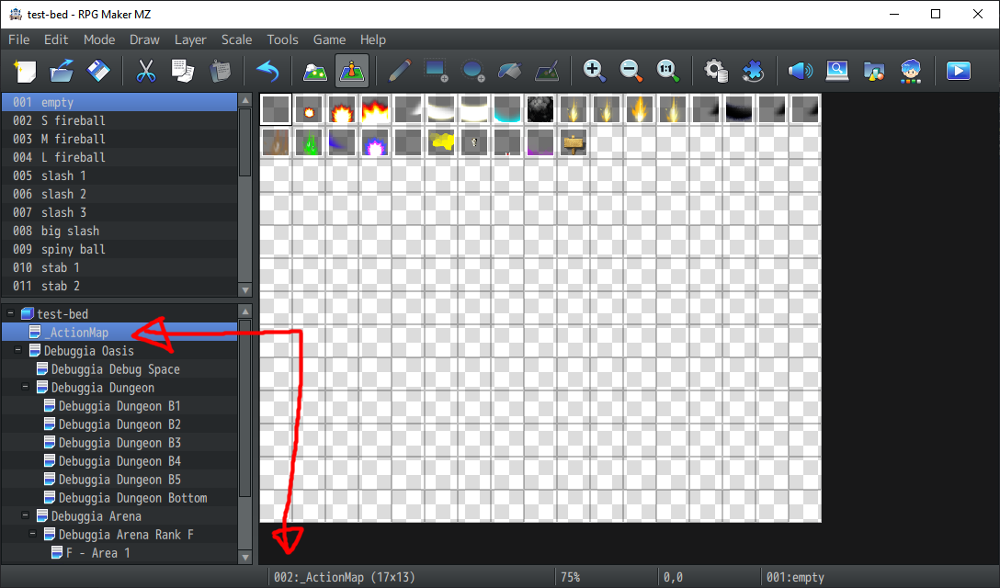
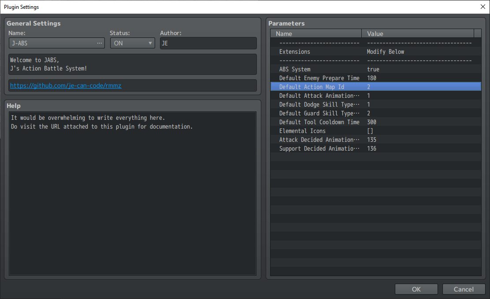
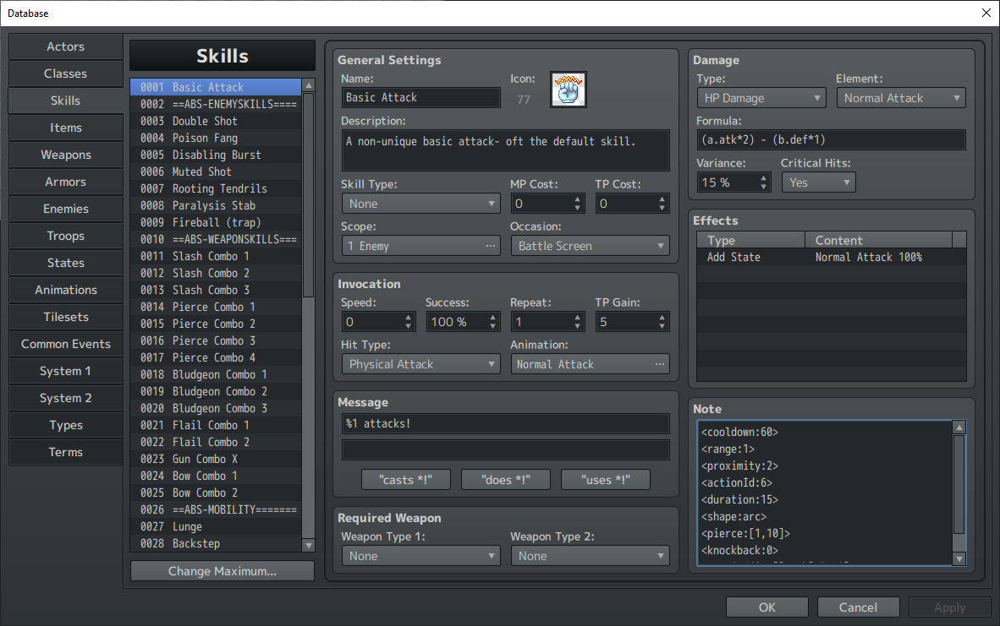
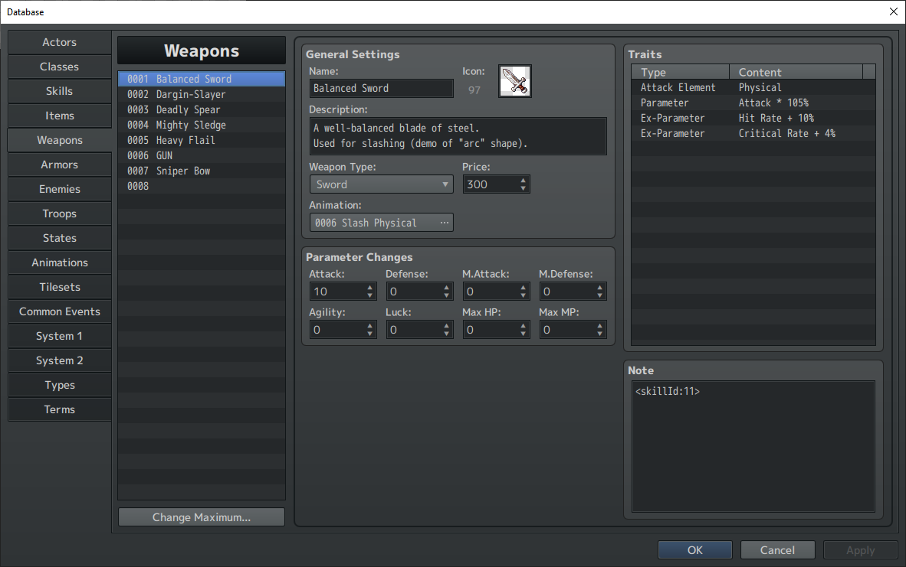
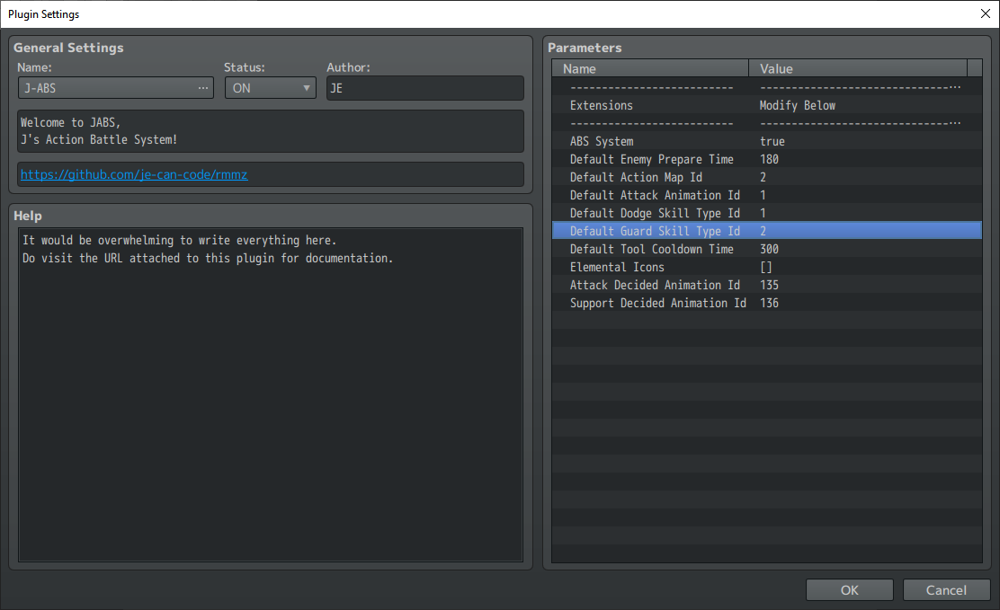

# Building a JABS Skill
In RPG Maker MZ, building a skill is fairly straight-forward: give it a name, add the costs, adjust the damage formula, give it whatever effects you want, and voila! A skill. Creating a skill for use in JABS includes these same steps! However, there are a few more that need to be followed. In this section, we'll go over the details for what it takes to make a skill from scratch.

Let's get started!

---

> NOTE: (RPG Maker MZ runs at ~60 fps, so typically anytime I reference "frames", you can assume that its roughly 60 frames per second of real time.)

```html
<combo:[23,5]>              // if this skill combos into another skill, this is the combo data (optional)
<cooldown:30>               // the base cooldown for a skill
<freeCombo>                 // when this tag is present, combo-ing does not require the skill to connect with a target
<range:0>                   // the range affects the size of the shape which determines collision
<proximity:2>               // the minimum distance this battler must be in order to use this skill (AI-only)
<actionId:24>               // the mapping to the event id from the action map that represents this skill
<duration:20>               // the duration in frames that this skill persists on the map
<shape:square>              // the collision shape for this skill
<poseSuffix:["-atk",0,12]>  // the pose data associated with this skill when performing it
<ignoreParry>               // when this tag is present, this skill cannot be parried by any targets it collides with
<castAnimation:124>         // the animation played on the battler when executing this skill on the map
```

---
>If you need to go back to the documentation list, click here:<br/>
[Go back to the documentation list.](../README.md)

---
## Step 1: Make sure your Action Map is In-Place.
In JABS, all actions are copies of events that already exist. These events live on what I call the "Action Map". If you didn't change any of the defaults, the id of this map should be set to `2`. If you used this test bed project as a base for your project, you probably already see a map that is aptly named "Action Map" and looks something like this:



If you don't have a map like this, you'll need to make one. If you have one already, but the map ID doesn't match what is listed in the plugin settings, you'll need to update that here:



> NOTE: The rest of Step 1 involves the details of making an "Action Map". If you already have one, you can skip to step 2, though you are free to read the rest of the step as it does explain the purpose and reasoning behind it.

The purpose of the "Action Map" is to house all of the "action events" that are used for your skills. For example, if you want the battler to swing their sword, the visual component is represented by an "action event", which is just an event like any other event, except that it's sole purpose is to collide with other battlers/targets, and would look like a sword slash instead of . These "action events" are what define whether or not a skill connects with an enemy battler- often literally in the sense that if it doesn't collide, then the target battler doesn't take damage. There is obviously more to what defines collision, but we'll talk about that later in this section.

Once you've created this map and updated the map id for the action map in the plugin settings, it is important to populate it with events that you want to represent the various skills that you intend to create. You are free to organize the events in any fashion that makes sense to you on this map. As you can see in the test bed, there is no significant organization.

I **strongly recommend** making the first event on this map (with event id 1) to be a blank empty event. The reason for this is that the default `actionId` is indeed `1`. So if you goof in the database and forget to map a skill to the corresponding action event (details later), the result is blank/nothing rather than some unexpected slash attack or something.

Many of the assets from this project are not mine to give, but I've found them in a multitude of places from the days of yore, so you're welcome to use the stuff.

---

# Step 2: Tell JABS how to handle the Skill!
Next is probably the most important part, as this is where the definition of what a skill does is determined: the million and one note tags in the database _on the skill itself_. I deliberately designed it so that skills should be created as-normal (like you would in a non-JABS project), but you need to add a pile of note tags in order to indicate to JABS how to handle the skill. Most the tags are necessary, and the list is up at the top of this tutorial. But let's take a look at this skill and go over each tag in greater detail:



As with the tags that go in the comments of a JABS battler event on the map, each tag should be on it's own line.

```html
<cooldown:60>
```
`cooldown` represents the cooldown that is associated with this skill. In the example here, the `60` represents the number of frames until this skill can be casted again. 

```html
<range:1>
```
`range` represents the size of the shape in regards to collision. Though most all events are governed by a single 1x1 tile on the map (regardless of how big it looks), the `range` will grant the "action events" the ability to extend the size of the designated shape in the context of collision. For example, if you have a `<shape:square>` and `<range:1>`, then the result will be that the skill will hit anything that is a 1-range square (which is a 3x3 square hitbox). If it was `<range:2>`, then it'd be a 2-range square (which is a 5x5 square hitbox). You can read the section about shapes to learn more about how to build the hitboxes you want.

```html
<proximity:2>
```
`proximity` represents the minimum distance that the battler performing the skill must be to it's target in order to perform the skill. This obviously doesn't affect the player, but any AI-controlled battler adheres to this rule. If the skill is never used by AI-controlled battlers (like enemies or allies not-controlled-by-the-player) then this tag is unnecessary.

```html
<actionId:6>
```
`actionId` represents the binding between this skill and it's visual "action event" from the "action map" that was setup in an earlier step. If this is not provided, then this will default to `1`. It is important to assign this, as it is the visual component associated with executing a skill.

```html
<duration:15>
```
`duration` represents the duration in frames for how long the corresponding "action event" will persist on the map. It is not required, but if you want a skill to shoot across the map, you probably want to use this tag to ensure it persists long enough. In this case, with a `duration` of only `15`, the skill will persist for only ~1/4 of a second.

```html
<shape:arc>
```
`shape` represents the shape of the hitbox associated with the skill. The `shape` grows/shrinks based on the `range`. Typically, the bigger the `range`, the bigger the `shape`. Check the glossary of tags to learn more about the available shapes.

```html
<pierce:[1,10]>
```
`pierce` represents the number of hits this particular skill can potentially land on a single target. The first number, the `1` in this case, is the number of hits this the skill can hit, and the second number, the `10`, is the number of frames between hits.
> NOTE: The sample you see here has `1` as the number of hits. This means the tag is pointless, as all skills hit at least once. You do not need this tag if you're not going to have the skill hit more than once.

```html
<knockback:0>
```
`knockback` represents the number of tiles the target will be thrown back when this skill connects. It is reduced by the `knockbackResist` tag that can be found on actors/enemies. If you have `0` as the `knockback`, then the character will be thrown up in the air for a brief moment, but not actually be knocked back anywhere. If you omit this tag, the skill will not hit the target back at all.

```html
<poseSuffix:["-atk",0,12]>
```
`poseSuffix` represents the crude "animation" functionality associated with JABS. This tag will cause the battler using the skill to change their character sprite image briefly into another for the duration specified. The first value, `"-atk"` in the example, is the suffix of the character's spritesheet you want to change to. This "suffix" assumes you'll be changing into a sheet with the same base name plus a little more. For example, in the demo you'll see that the character spritesheet's name for the leader is `chara_je`. With a `poseSuffix` of `"-atk"`, then this would be changing the character into `chara_je-atk` character sheet temporarily. The second value, the `0`, is the zero-based index to use on said character sheet. `0` indicates it'll use the upper-left most character. The third and final value, the `12`, represents the amount of time in frames to spend transformed. `12` frames is roughly 1/5 of a second spent transformed into `chara_je-atk`.
> NOTE: It is untested what will happen if you try to leverage this functionality with single-character spritesheets, such as those whose filename starts with `$`.

## Step 3: Assign the skill!
At this point, you now have an "action map" with "action events", and now even a skill that hopefully maps to one of those "action events"! But in order to use the skill, the skill will need to be assigned in one of two ways:
- assigned to a weapon to be used as a weapon skill (like a slash that the player will mash).
- learned as an "assignable skill", like a fireball spell or air slash sword technique.

If you're opting to make your skill a weapon skill, its one easy tag that you add to the weapon's note tag box:



```html
<skillId:11>
```
`skillId` represents the skill id that this weapon will perform when the corresponding button is pressed while this weapon is equipped. If it is equipped in your main hand, then pressing the mainhand button will perform it, while if the battler is dual-wielding and you stick this in the offhand slot, it'll require you press the offhand button instead.

If you're opting to make this skill an "assignable skill", then you'll need to ensure the battler has learned the skill by normal RPG Maker MZ means, and can perform it (not blocked by a state, has the resources, knows the skill, is the proper level, etc). In addition to that, you'll also need to actually equip the skill through the JABS quick menu while you're on the map to one of your slots, and press the correct key combination to use it.

## What about Guarding/Dodging?
Never fear! This functionality was indeed built into the engine as well. However, it is strongly encouraged to actually look into the demo of this engine to see and understand the connectivity between equipment, skills, and skill types. I'll try to spell out the details here as well though.

### Guarding as a skill type
In order to guard, a skill has to first be identified as "a guarding skill". Fortunately, that is pretty straight-forward. Just make yourself a new type in the database under `Skill Types`, call it whatever you want (should probably be related to guarding), and grab it's `Skill Type Id` and go update the plugin settings' `Guard Skill Type Id` (which defaults to `2`):



Any skill that is of this `Skill Type` that the player knows will show up when trying to assign guard skills via the JABS quick menu! (Also be sure that the player has access to this skill type) 

Guard skills are unique in the sense that their effects persist while the button is being held! Also, guard skills get new tags just for them that we should probably go over:

```html
<guard:[-10, -40]>
```
The `guard` tag represents the data associated with guarding, specifically how damage is affected while the player is holding the guard button. The first value, in this example `-10`, represents the amount of flat damage to be reduced while guarding. The second value, in this example `-40`, represents the percent of damage to be reduced while guarding.
> NOTE: in favor of the player, if both flat and percent are present on the same skill, the percent damage effects are applied first, then the flat damage effects are applied.

```html
<parry:6>
```
The `parry` tag is the number of frames in which a `precise-parry` effect is available. `Precise-parry` is a complete mitigation of damage from an incoming attack that connects for the first `X` frames after the player presses the guard button. This tag is optional. If the tag is missing, the player simply cannot `precise-parry` with this guard skill, and by extension cannot `counter parry`.

```html
<counterGuard:42>
```
The `counterGuard` tag represents the skill id that is automatically performed if the player is hit by any incoming attacks while guarding. An example application of this would be auto-countering with fireballs or something when hit while guarding with a fire shield. 

```html
<counterParry:13>
```
The `counterParry` tag is very similar to the `counterGuard` tag in functionality, but this counter effect only applies if the player successfully performs a `precise-parry`. 

> NOTE: it is untested what will happen if you apply a cost to a guard skill.

### Dodging as a skill type
In addition to guarding, there is also the mobility behind "dodge skills". Very similar to "guard skills", these skills will show up in the JABS quick menu if they are properly assigned the skill type that you decide is the "dodge" skill type, and map it in the plugin's settings. These skills are simple in nature: they force movement of the player in a given direction based on the skill tags. 

Let's look over those new skill tags:

```html
<moveType:backward>
```
`moveType` can be one of three values:
- **backward**: Force the player to move in the opposite direction they are facing `X` number of tiles.
- **forward**: Force the player to move in the same direction they are facing `X` number of tiles.
- **directional**: Force the player to move in the direction that the player is holding at the time the skill is executed. If the player is not holding any directions, then they will default to move the same direction they are facing, `X` number of tiles.

You'll also note that there is no indication of how many tiles to move in this tag! That is because dodge skills also leverage the `<range:X>` tag to determine how far forward/backward/wherever the skill moves the player.

```html
<invincible>
```
`invincible` simply means that for the duration of the forced movement in some direction, the player will be "invincible".

---
# Final Notes
Building and assigning skills is indeed a process, and I highly encourage that once you successfully setup skills how you like them and confirm they are functional, that you leverage copy-paste to make more.

Additionally, skills when connecting with their targets, will apply in much the same way as they do in the default battle system. The only major thing that has changed is the fact that skills cannot "miss" like they used to (not to be confused with "evaded", which still is possible). The default battle system has a concept of "miss" AND "evade", but in favor of simply being able to miss because you swung your sword with no enemies around, the concept of "miss" was removed entirely. All skills will not "miss" (but can be "evaded") as long as the "action event"'s hitbox connects with it's target. If you do not know the difference between "miss" and "evaded", that is fine- this is just an extra detail for those who care 😁.