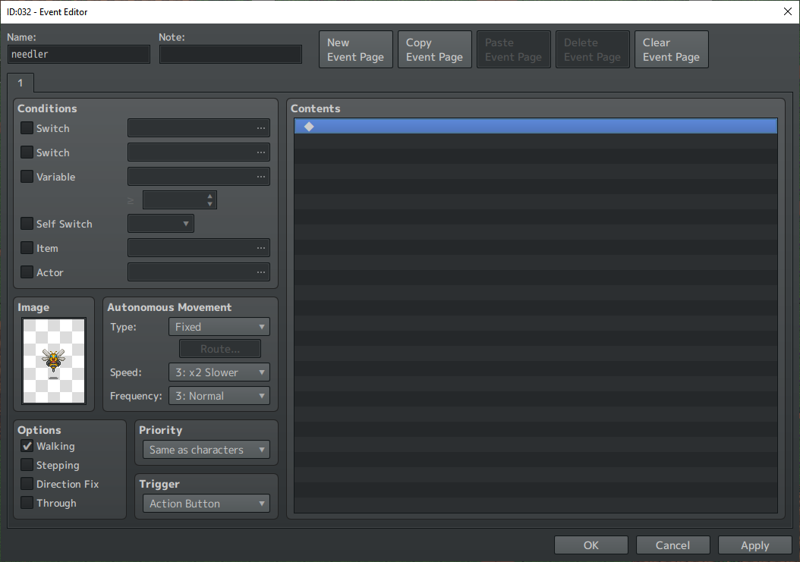
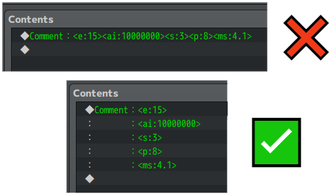
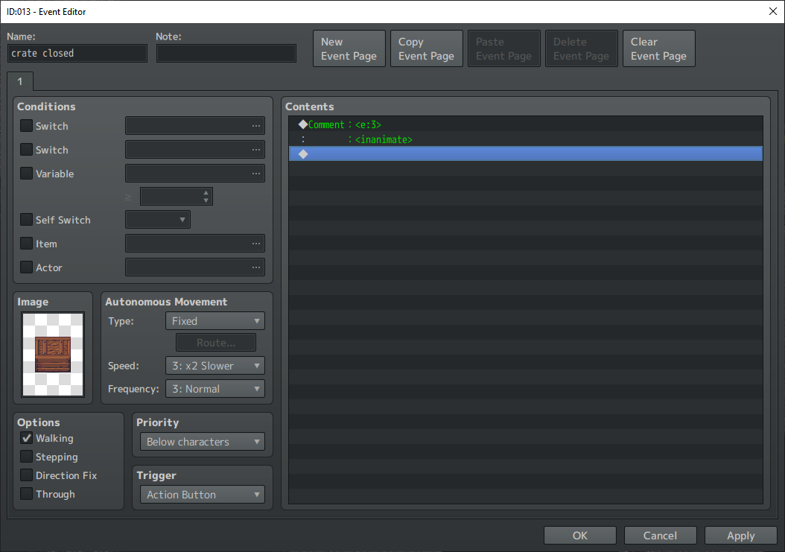

# Building a JABS enemy
When it comes to building an ABS game, one of the most prominent elements is obviously the various enemies the player will encounter over the course of their adventure. In this section, we will go over the basics of creating an enemy.

Let's get started!

---
>If you need to go back to the documentation list, click here:<br/>
[Go back to the documentation list.](../README.md)

---
Here is a shorthand reference list of all tags that are available for constructing your battlers on the map:
```html
<e:15>        // the enemy id
<team:1>      // the team id (optional, defaults to 1)
<ai:10000000> // the ai traits
<s:3>         // the sight radius
<p:8>         // the pursuit radius
<ms:4.1>      // the custom decimal move speed (optional, will use event's movespeed if not provided)
<ad:180>      // the duration in frames this battler will remain alerted (optional, use with other alert tags)
<as:2>        // the sight boost gained while in an alert state (optiona, use with other alert tags)
<ap:1>        // the pursuit boost gained while in an alert state (optional, use with other alert tags)
<noIdle>      // forces no movement while this battler is not engaged.
<noHpBar>     // hides the hp bar for this battler on the map.
<invincible>  // renders this battler unable to be hit by any actions.
<inanimate>   // default applies: noIdle & noHpBar effects, along with preventing this battler from engaging. (optional)
```
---
## Step 1: Make the event.
Every enemy and battler that the player encounters is represented on the map by a everyday event. If you're using JABS, you're probably familiar with how to create an event. So go ahead and make one, give it a name, and assign it a character sprite. Here is mine:



---
## Step 2: Tell JABS that its a battler.
With the above screenshot, you'll realize quickly that JABS would have no idea that this is an enemy! In order for JABS to recognize that it is an enemy, you'll need to give it some parameters. JABS reads every event on the map and searches for _some very particular comment structures_. These comments look a lot like the general pattern of note tags you'll see leveraged by other plugins.

> NOTE: You _could_ refer to the notetag glossary, but lets be real: that is a mighty long list! So for your convenience, I've provided every comment tag that can be leveraged up at the top of this document.

So the next step is to add a few of those tags. Here are what I'd consider the _absolute bare minimum tags to define a regular enemy_.

```html
<e:15>        // the enemy id
<ai:10000000> // the ai traits
<s:3>         // the sight radius
<p:8>         // the pursuit radius
```


It is important to note that every item is on it's own line. If you add multiple items on a single line, though it may fit, none of that line will be interpreted by JABS.



---
## Step 3: Making your JABS battlers "alertable".
Now, based on the event editor screenshot above in step 2, I noted that it is the bare minimum to tell JABS that it is a battler, and that it has a few basic parameters. _Technically_, the bare minimum is **only** the `<e:15>` tag, which maps to the enemy's id in the database... but without the `<ai:10000000>` the AI will default to basically dumb as a box of rocks (sits there and does nothing but get hit by the player, in sadness). Without the `<s:3>` tag, the battler won't react to the nearby presence of the player. Without the `<p:8>`, the player can easily get out of the enemy's sight by stepping a few tiles away. 

But, there is more you can do! Optionally of course. Let's say you give the player a ranged weapon that hits from 6 tiles away. This enemy here that has a sight range of 3 can be shot from outside of that range without any retaliation. The player will be able to easily defeat this foe and basically get free rewards just for having a ranged weapon! Enter: **the alert state**.

Though they are marked as optional, I built the feature because it simply makes sense. As a result, I encourage it go on all enemies, as there is no default alert duration/sight/pursuit values. You may note that RPG Maker MZ _only allows 6 lines of comments per comment event command_. Never fear! JABS will scan every single comment that exists on _the active page_, so just add another comment event command and add the alert details you want:
```html
<ad:180>      // the duration in frames this battler will remain alerted
<as:2>        // the sight boost gained while in an alert state
<ap:1>        // the pursuit boost gained while in an alert state
```


---
## Step 4: The other tags and use cases
Sometimes, you're like "dang, this is an ABS and I wish I could make a destructible like a tuft of grass from zelda or maybe a crate in some mines that drops some loot but doesn't fight back!"... and you'd be right! You should make those things, and thanks to the inanimate tag, you can do just that!

```html
<inanimate>   // default applies: noIdle & noHpBar effects, along with preventing this battler from engaging.
```



When you apply the `<inanimate>` tag to an enemy, it is the same as applying the following tags to the battler:
```html
<s:0>
<p:0>
<noHpBar>
<noIdle>
```
This also prevents the battler from being "alertable" and ever engaging in combat. They are just inanimate objects after all!

Sometimes though, you may want an enemy that just has maybe one or two of those traits.
- add the `<noHpBar>` trait if you want the hp gauge to be hidden on the battler (maybe for a boss?).
- add the `<noIdle>` trait if you'd prefer the battlers not wander around while they are not engaged in combat (for stationary enemies, like plants maybe?)
- add the `<invincible>` trait if there is some particular reason you want the battler to be totally invincible (traps? conditionals?).

Lastly, you may have noted in the screen snippet about tag formatting or in the list at the top that there is another tag I haven't mentioned: the custom movespeed modifier. This one is totally optional, but personally I've found that the rigidity of going from movespeed "4" to movespeed "3" or "5" is a dramatic difference. Sometimes enemies just need to be _a hair slower_, or _a hair faster_. This is where the custom movespeed tag comes into play! By adding `<ms:4.1>`, then the event that the battler is attached to will have a movespeed that is just a bit above the default "Normal" movespeed. If this tag exists, **the event page's movespeed will be entirely ignored**.

---
## Bonus: Step 5: Leveraging event conditionals to "transform" enemies.
Though we have now told JABS that this event is indeed an enemy, that doesn't mean its not also an event, too! With that in mind, you can leverage this along with your imagination to allow enemies to be "transformed". When I say "transformed", I just mean "on one page it has one enemy's definition but a second page has another enemy's definition". Pictures speak louder than text, so allow me to give you an example:


Here is the most basic case example: We have an enemy, in this case our legendary `Needler`, the most feared enemy in the land of JABS! You may notice that his page1 has no conditions, and also has all the necessary comments to build out a plain old needler... but there is one new comment we didn't use when building our basic needler: the `<invincible>` tag! Oh no! This means the battler is **totally invincible to all incoming attacks** (the hits simply won't connect rather than hitting for 0 or something). However, you'll see that on the same event, there is a second page with a **switch** condition. Like any other event, when that condition is met, then that is the page that will be parsed and define the enemy (without the `<invincible>` tag!). This parsing happens on the fly, so should you flip a switch even while engaged in combat with page 1 and it flips to page 2, the enemy will suddenly become not invincible and the player can reign victorious!
> NOTE: In the instance you are flipping from one enemy to another mid-combat, the enemy's HP% is not preserved, as it is reparsed and considered a new enemy on the map.

---
## Bonus: Step 6: Actions after death.
Extending on the previous bonus step, as I mentioned: all enemies are ultimately also still just events. As such, if you add event commands in there with the comments, they will be executed upon the battler's defeat. Let us take this event as an example:


You'll notice that in addition to being boring old grass, you also have a regular "show text" event command in there with some text:
> ouch you cut me

Which you'll see translates to this effect:


> NOTE: The enemy that triggered the event (and any other enemies defeated with the same attack) will persist on the map for the duration of the running event. This is intended, as the event must exist while it is running or the event processor will throw a tantrum.

---
## Final Notes:
With all of these features, what you can do is only limited by your imagination (and RPG Maker MZ)! If you find yourself desiring features that make sense, feel free to either ping me about it and I'll see what I can do, or spin up a merge request against this repo and I'll review/consider it 💯.

>If you need to go back to the documentation list, click here:<br/>
[Go back to the documentation list.](../README.md)